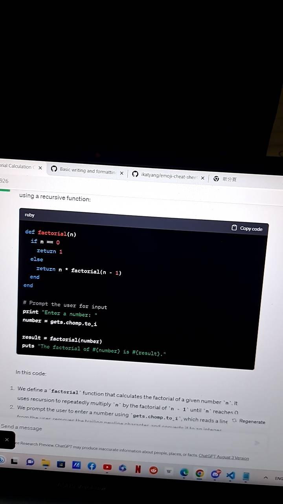
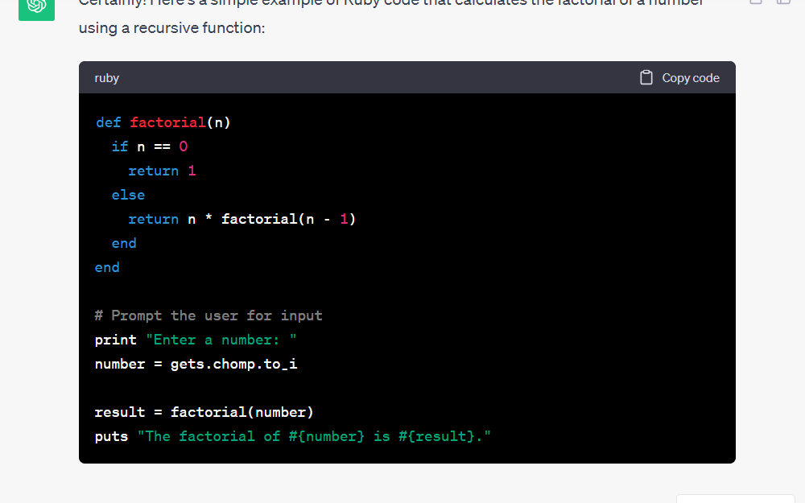

# Writing Good Documentation

## Step 1 - Using Codeblocks

Codeblocks in markdown make it *very easy* for tech people to **copy, paste, share** code.
A good _Cloud Engineer_ use Codeblocks whenever possible.

Because it allows others to copy and pasta their code to replicate or research issues.

- In order to create codeblocks in markdown you need to use three backtricks(`)
- Not to be confused with qoutation(')

```
def factorial(n)
  if n == 0
    return 1
  else
    return n * factorial(n - 1)
  end
end

# Prompt the user for input
print "Enter a number: "
number = gets.chomp.to_i

result = factorial(number)
puts "The factorial of #{number} is #{result}."

```
- When you can you should attempt to apply syntax highlighting to your codeblocks
```ruby
def factorial(n)
  if n == 0
    return 1
  else
    return n * factorial(n - 1)
  end
end

# Prompt the user for input
print "Enter a number: "
number = gets.chomp.to_i

result = factorial(number)
puts "The factorial of #{number} is #{result}."

```
This is my desktop background image


Good Cloud Engineerings use codeblocks for both Code and Errors that appear in the Console.

```bash
Traceback (most recent call last):
        2: from /usr/bin/irb:11:in `<main>'
        1: from (irb):1
NameError (undefined local variable or method `some_value' for main:Object)
irb(main):002:0>
```
> Here is an example of using a codeblock for an error that appears in bash
When you can always provide codeblock instead of screenshot
If you need to take a screenshot make sure 

## Step 1 - How to take screenshoot

A screenshoot is when you capture a parot of your screen from your laptop, desktop, or phone.
This is not be confused with take a photo with your phone.

**DON'T DO THIS**


This is what a screenshot from your computer should look like

**DO THIS INSTEAD**

To take screenshots on both macOS or Windows, you can use the following hotkeys:

Certainly! Here are the common hotkeys for taking screenshots on both macOS and Windows:

**macOS:**

1. **Capture Entire Screen:**
   - Press `Command (⌘) + Shift + 3`.
   - The screenshot will be saved to your desktop by default.

2. **Capture Selected Portion of the Screen:**
   - Press `Command (⌘) + Shift + 4`.
   - Drag to select the portion of the screen you want to capture.
   - The screenshot will be saved to your desktop by default.

3. **Capture a Specific Window:**
   - Press `Command (⌘) + Shift + 4`, then press `Spacebar`.
   - Click on the window you want to capture.
   - The screenshot of the selected window will be saved to your desktop by default.

4. **Capture the Touch Bar (on MacBook Pro with Touch Bar):**
   - Press `Command (⌘) + Shift + 6`.
   - The screenshot of the Touch Bar will be saved to your desktop by default.

**Windows:**

1. **Capture Entire Screen:**
   - Press `PrtScn` (Print Screen) key.
   - The screenshot will be copied to your clipboard. You can then paste it into an image editor (like Paint) and save it.

2. **Capture the Active Window:**
   - Press `Alt + PrtScn`.
   - The screenshot of the active window will be copied to your clipboard.

3. **Capture a Selected Portion of the Screen (Windows 10 and later):**
   - Press `Windows + Shift + S`. This opens the Snip & Sketch tool.
   - Select the area you want to capture.
   - The screenshot will be copied to your clipboard, and you can use the Snip & Sketch tool to annotate or save it.

4. **Capture a Specific Window (Windows 10 and later):**
   - Press `Alt + PrtScn`.
   - The screenshot of the active window will be copied to your clipboard.

5. **Capture the Entire Screen and Save as a File (Windows 10 and later):**
   - Press `Windows + Shift + S`.
   - Select the area you want to capture.
   - Click the "Copy" button.
   - Open an image editor or application (like Paint or Microsoft Word) and paste (`Ctrl + V`) the screenshot. Then, you can save it.

The exact hotkeys and methods may vary slightly depending on your Windows version, but these are the most common shortcuts for taking screenshots on macOS and Windows.




## Step 3 - Use GitHub Flavored Task Markdown Lists

Github extends Markdown to have a list where you can check off items.[<sup>[1]</sup>](#external-references)

- [x] Finish Step1
- [ ] Finish Step2
- [x] Finish Step3

### Step 4 - Use Emojis (Optional)

GitHub Flavored Markdown(GFM) supports emoji shortcodes.

| Name | shortcode | Emoji |
| --- | --- | --- |
| Cloud | `:cloud:` | :cloud: |
| Cloud with lighting | `:cloud_with_lighting:` | 🌩️ |

### Step 5 - how to create a table

You can use the following markdown formate to create tables: 

```md
| Name | shortcode | Emoji |
| --- | --- | --- |
| Cloud | `:cloud:` | :cloud: |
| Cloud with lighting | `:cloud_with_lighting:` | 🌩️ |


```
Github extends the functionality of Markdown tables to provide more alignment and table cell formatting options. [<sup>[2]</sup>](#external-references)


## External References

- [GitHub Flavored Markdown Spec](https://github.github.com/gfm/)
- [Basic writing and formatting Syntax(GitHub Flavored Markdown)](https://docs.github.com/en/get-started/writing-on-github/getting-started-with-writing-and-formatting-on-github/basic-writing-and-formatting-syntax)
- [GFM - Task Lists](https://docs.github.com/en/get-started/writing-on-github/getting-started-with-writing-and-formatting-on-github/basic-writing-and-formatting-syntax#task-lists)<sup>[1]</sup>
- [GFM - Emoji CheatSheet](https://github.com/ikatyang/emoji-cheat-sheet)
- [GFM - Tables (with extension)](https://github.github.com/gfm/#tables-extension-)<sup>[2]</sup>
